# 📚 API DOCUMENTATION - HỆ THỐNG KPI

## 📖 **MỤC LỤC**

1. [Tổng quan hệ thống](#1-tổng-quan-hệ-thống)
2. [Luồng dữ liệu KPI Module](#2-luồng-dữ-liệu-kpi-module)
3. [Authentication](#3-authentication)
4. [API Endpoints](#4-api-endpoints)
5. [Code Examples](#5-code-examples)
6. [Testing Guide](#6-testing-guide)

---

## 1. TỔNG QUAN HỆ THỐNG

### 1.1. Kiến trúc hệ thống

```
┌─────────────────────────────────────────────────────────────┐
│                        FRONTEND                             │
│  (React/Vue/Angular - HTTP Requests với JWT Token)         │
└─────────────────────────┬───────────────────────────────────┘
                          │ HTTPS/JSON
                          ▼
┌─────────────────────────────────────────────────────────────┐
│                      ASP.NET CORE WEB API                   │
│  ┌──────────────┐  ┌──────────────┐  ┌──────────────┐     │
│  │ Controllers  │  │  Services    │  │  Background  │     │
│  │ (API Layer)  │→ │ (Logic)      │→ │  Jobs        │     │
│  └──────────────┘  └──────────────┘  └──────────────┘     │
│         │                  │                  │             │
│         └──────────────────┴──────────────────┘             │
│                          │                                  │
│                          ▼                                  │
│  ┌────────────────────────────────────────────────────┐   │
│  │     Entity Framework Core (ORM)                    │   │
│  └────────────────────────────────────────────────────┘   │
└─────────────────────────┬───────────────────────────────────┘
                          │ SQL
                          ▼
┌─────────────────────────────────────────────────────────────┐
│                   POSTGRESQL DATABASE                       │
│  ┌────────────┐ ┌─────────────┐ ┌────────────┐            │
│  │   Tables   │ │   Indexes   │ │  Relations │            │
│  └────────────┘ └─────────────┘ └────────────┘            │
└─────────────────────────────────────────────────────────────┘
```

### 1.2. Database Schema - KPI Module

```
┌─────────────────────┐
│   Departments       │
│ - Id               │
│ - Name             │
│ - ResionId         │
└──────────┬──────────┘
           │
           │ 1-N
           ▼
┌─────────────────────┐         ┌─────────────────────────┐
│       KPI           │ 1───N   │ KpiCommissionTier       │
│ - Id               │         │ - Id                    │
│ - Name             │         │ - KpiId (FK)            │
│ - DepartmentId (FK)│         │ - TierLevel             │
│ - KpiType          │         │ - MinRevenue            │
│ - TargetValue      │         │ - MaxRevenue            │
│ - CommissionType   │         │ - CommissionPercentage  │
│ - Period           │         │ - IsActive              │
│ - StartDate        │         └─────────────────────────┘
│ - EndDate          │
│ - IsActive         │
└──────────┬──────────┘
           │
           │ 1-N
           ▼
┌─────────────────────────┐
│ UserKpiAssignment       │
│ - Id                    │
│ - UserId (FK)           │
│ - KpiId (FK)            │
│ - CustomTargetValue     │
│ - Weight                │
│ - AssignedDate          │
│ - IsActive              │
└──────────┬──────────────┘
           │
           │ 1-N
           ▼
┌─────────────────────────┐
│    KpiRecord            │
│ - Id                    │
│ - KpiId (FK)            │
│ - UserId (FK)           │
│ - Period                │
│ - ActualValue           │
│ - TargetValue           │
│ - AchievementPercentage │
│ - CommissionAmount      │
│ - CommissionPercentage  │
│ - CommissionTierLevel   │
│ - Status                │
│ - ApprovedBy            │
│ - ApprovedAt            │
│ - CreatedAt             │
└─────────────────────────┘

┌─────────────────────────┐
│   MarketingBudget       │
│ - Id                    │
│ - UserId (FK)           │
│ - Period                │
│ - ApprovedBudget        │
│ - ActualSpending        │
│ - TargetROI             │
│ - ActualROI             │
│ - Status                │
└──────────┬──────────────┘
           │ 1-N
           ▼
┌─────────────────────────┐
│   MarketingExpense      │
│ - Id                    │
│ - MarketingBudgetId (FK)│
│ - UserId (FK)           │
│ - ExpenseType           │
│ - Amount                │
│ - ExpenseDate           │
│ - LeadsGenerated        │
│ - CostPerLead           │
│ - Status                │
└─────────────────────────┘

┌─────────────────────────┐
│       Lead              │
│ - Id                    │
│ - CreatedByUserId (FK)  │
│ - FullName              │
│ - Email                 │
│ - PhoneNumber           │
│ - Source                │
│ - Status                │
│ - IsConverted           │
│ - CustomerId (FK)       │
│ - ConvertedAt           │
│ - RevenueGenerated      │
│ - ROI                   │
└─────────────────────────┘
```

---

## 2. LUỒNG DỮ LIỆU KPI MODULE

### 2.1. Timeline - Luồng hoạt động theo thời gian

```mermaid
gantt
    title Luồng KPI - Chu kỳ 1 tháng
    dateFormat  DD
    section Setup (Đầu tháng)
    Admin tạo KPI           :a1, 01, 1d
    Admin tạo Tiers         :a2, after a1, 1d
    Admin gán Users         :a3, after a2, 1d
    Admin duyệt Budget (MKT):a4, after a3, 1d
    section Working (Trong tháng)
    Users làm việc          :b1, 05, 26d
    Sales: Contracts        :b2, 05, 26d
    Marketing: Leads/Expense:b3, 05, 26d
    IT: Tickets             :b4, 05, 26d
    section Calculate (Cuối tháng)
    Cronjob tính KPI        :c1, 31, 1d
    Tạo KpiRecords          :c2, 31, 1d
    section Approval (Đầu tháng sau)
    Admin xem báo cáo       :d1, 32, 1d
    Admin phê duyệt         :d2, after d1, 1d
    Tính lương/thưởng       :d3, after d2, 3d
```



---

### 2.2. Luồng chi tiết theo phòng ban

#### **🔷 A. SALES - Luồng dữ liệu**

```
┌─────────────────────────────────────────────────────────────────┐
│ BƯỚC 1: ADMIN SETUP (Ngày 01/01)                              │
└─────────────────────────────────────────────────────────────────┘

1. Tạo KPI Sales
POST /api/KPIs
{
  "name": "Doanh số bán hàng tháng 1/2025",
  "departmentId": 1,  // Sales
  "kpiType": "Revenue",
  "targetValue": 15000000,  // ← Sẽ dùng làm base (100% KPI)
  "commissionType": "Tiered",
  "period": "Monthly",
  "startDate": "2025-01-01",
  "endDate": "2025-01-31"
}
→ Response: { "id": 1, ... }

2. Tạo bậc hoa hồng
POST /api/KpiCommissionTiers/bulk
{
  "kpiId": 1,
  "tiers": [
    { "tierLevel": 1, "minRevenue": 15000000, "maxRevenue": 30000000, "commissionPercentage": 5 },
    { "tierLevel": 2, "minRevenue": 30000000, "maxRevenue": 60000000, "commissionPercentage": 7 },
    { "tierLevel": 3, "minRevenue": 60000000, "maxRevenue": 100000000, "commissionPercentage": 8 },
    { "tierLevel": 4, "minRevenue": 100000000, "maxRevenue": null, "commissionPercentage": 10 }
  ]
}
→ Lưu vào table: KpiCommissionTiers

3. Gán KPI cho Sales users
POST /api/UserKpiAssignments
{
  "userId": 5,  // Sales A
  "kpiId": 1,
  "customTargetValue": null,  // Dùng targetValue chung = 15tr
  "weight": 100,
  "isActive": true
}
→ Lưu vào table: UserKpiAssignments

┌─────────────────────────────────────────────────────────────────┐
│ BƯỚC 2: SALES USER LÀM VIỆC (01/01 - 31/01)                   │
└─────────────────────────────────────────────────────────────────┘

Sales User (userId=5) làm việc:
- Tạo Customer
- Tạo SaleOrder
- Tạo Contract
- Chuyển Contract.Status = "Paid"

Ví dụ: Sales A tạo 3 contracts trong tháng
- Contract 1: 10,000,000 (Status = "Paid", CreatedAt = 2025-01-10)
- Contract 2: 8,000,000 (Status = "Paid", CreatedAt = 2025-01-15)
- Contract 3: 7,000,000 (Status = "Paid", CreatedAt = 2025-01-25)
→ Tổng: 25,000,000 VND

┌─────────────────────────────────────────────────────────────────┐
│ BƯỚC 3: CRONJOB TÍNH KPI (31/01 - 23:59)                      │
└─────────────────────────────────────────────────────────────────┘

KpiCalculationJob.CalculateSalesKpiAsync() chạy:

1. Lấy UserKpiAssignment của Sales A (userId=5, kpiId=1, period="2025-01")

2. Lấy base target (100% KPI):
   baseTarget = SELECT MinRevenue FROM KpiCommissionTiers 
                WHERE KpiId = 1 AND TierLevel = 1
   → baseTarget = 15,000,000

3. Tính doanh số thực tế:
   totalRevenue = SELECT SUM(TotalAmount) FROM Contracts
                  WHERE UserId = 5 
                    AND Status = 'Paid'
                    AND CreatedAt BETWEEN '2025-01-01' AND '2025-01-31'
   → totalRevenue = 25,000,000

4. Tính % KPI:
   achievementPercentage = (25,000,000 / 15,000,000) × 100 = 166.67%

5. Tìm tier phù hợp:
   25tr nằm trong range [15tr, 30tr) → Bậc 1 (5%)

6. Tính hoa hồng:
   commissionAmount = 25,000,000 × 5% = 1,250,000 VND

7. Tạo KpiRecord:
   INSERT INTO KpiRecords VALUES (
     KpiId = 1,
     UserId = 5,
     Period = "2025-01",
     ActualValue = 25000000,
     TargetValue = 15000000,
     AchievementPercentage = 166.67,
     CommissionAmount = 1250000,
     CommissionPercentage = 5,
     CommissionTierLevel = 1,
     Status = "Pending",
     RecordDate = "2025-01-31 23:59:00",
     CreatedAt = "2025-01-31 23:59:05"
   )

┌─────────────────────────────────────────────────────────────────┐
│ BƯỚC 4: ADMIN PHÊ DUYỆT (01/02)                               │
└─────────────────────────────────────────────────────────────────┘

1. Admin xem danh sách:
GET /api/KpiRecords?period=2025-01&status=Pending
→ Response: [{ id: 1, userId: 5, actualValue: 25000000, ... }]

2. Admin phê duyệt:
POST /api/KpiRecords/1/approve
→ UPDATE KpiRecords SET Status = "Approved", ApprovedBy = 1, ApprovedAt = NOW()

3. Kết quả:
- Sales A nhận 1,250,000 VND hoa hồng
- Tính vào lương tháng 1
```

---

#### **🔷 B. MARKETING - Luồng dữ liệu**

```
┌─────────────────────────────────────────────────────────────────┐
│ BƯỚC 1: ADMIN SETUP (Ngày 01/01)                              │
└─────────────────────────────────────────────────────────────────┘

1. Tạo KPI Marketing
POST /api/KPIs
{
  "name": "KPI Marketing tháng 1/2025",
  "departmentId": 3,  // Marketing
"kpiType": "Leads",
  "targetValue": 200,  // ROI 200% = 100% KPI
  "commissionType": "Tiered",
  "period": "Monthly"
}
→ Response: { "id": 2, ... }

2. Tạo bậc hoa hồng (dựa trên ROI)
POST /api/KpiCommissionTiers/bulk
{
  "kpiId": 2,
  "tiers": [
    { "tierLevel": 1, "minRevenue": 200, "maxRevenue": 300, "commissionPercentage": 3 },
    { "tierLevel": 2, "minRevenue": 300, "maxRevenue": 400, "commissionPercentage": 5 },
    { "tierLevel": 3, "minRevenue": 400, "maxRevenue": null, "commissionPercentage": 7 }
  ]
}
→ minRevenue/maxRevenue = ROI %

3. Gán KPI cho Marketing user
POST /api/UserKpiAssignments
{
  "userId": 10,  // Marketing A
  "kpiId": 2
}

4. Duyệt MarketingBudget
POST /api/MarketingBudgets
{
  "userId": 10,
  "period": "2025-01",
  "approvedBudget": 10000000,  // 10 triệu
  "targetROI": 200,  // 200%
  "status": "Approved"
}
→ Lưu vào table: MarketingBudgets

┌─────────────────────────────────────────────────────────────────┐
│ BƯỚC 2: MARKETING USER LÀM VIỆC (01/01 - 31/01)               │
└─────────────────────────────────────────────────────────────────┘

Marketing User (userId=10) làm việc:

A. Tạo Leads:
POST /api/Leads
{
  "createdByUserId": 10,
  "fullName": "Khách hàng A",
  "source": "Facebook",
  "campaign": "Tết 2025"
}
→ Tạo 150 leads trong tháng

B. Báo cáo chi phí:
POST /api/MarketingExpenses
{
  "marketingBudgetId": 1,
  "userId": 10,
  "expenseType": "FacebookAds",
  "amount": 3000000,  // 3 triệu
  "leadsGenerated": 50
}
→ Tổng chi: 8,000,000 (3tr + 2tr + 3tr)
→ Hệ thống tự động:
   - Tính costPerLead = 3tr / 50 = 60k/lead
   - Cập nhật MarketingBudget.ActualSpending += 3tr

C. Chuyển đổi Leads:
PUT /api/Leads/123
{
  "status": "Converted",
  "isConverted": true,
  "customerId": 456,
  "convertedAt": "2025-01-20",
  "revenueGenerated": 30000000  // 30 triệu
}
→ 120 leads converted, tổng revenue: 32,000,000

┌─────────────────────────────────────────────────────────────────┐
│ BƯỚC 3: CRONJOB TÍNH KPI (31/01 - 23:59)                      │
└─────────────────────────────────────────────────────────────────┘

KpiCalculationJob.CalculateMarketingKpiAsync() chạy:

1. Lấy MarketingBudget:
   SELECT * FROM MarketingBudgets 
   WHERE UserId = 10 AND Period = '2025-01'
   → approvedBudget = 10,000,000
   → actualSpending = 8,000,000
   → targetROI = 200

2. Tính doanh thu từ leads đã convert:
   totalRevenue = SELECT SUM(RevenueGenerated) FROM Leads
                  WHERE CreatedByUserId = 10
                    AND IsConverted = true
                    AND ConvertedAt BETWEEN '2025-01-01' AND '2025-01-31'
   → totalRevenue = 32,000,000

3. Tính ROI:
   actualROI = ((32,000,000 - 8,000,000) / 8,000,000) × 100 = 300%

4. Update MarketingBudget:
   UPDATE MarketingBudgets SET ActualROI = 300 WHERE Id = 1

5. Tính % KPI:
   achievementPercentage = (300 / 200) × 100 = 150%

6. Tìm tier phù hợp:
   ROI 300% → Bậc 2 (300-400%) → 5%

7. Tính hoa hồng:
   commissionAmount = approvedBudget × 5% = 10,000,000 × 5% = 500,000

8. Lấy thông tin leads:
   totalLeads = 150
   convertedLeads = 120
   leadConversionRate = (120 / 150) × 100 = 80%
   costPerLead = 8,000,000 / 150 = 53,333
   costPerConversion = 8,000,000 / 120 = 66,667

9. Tạo KpiRecord:
   INSERT INTO KpiRecords VALUES (
     KpiId = 2,
     UserId = 10,
     Period = "2025-01",
     ActualValue = 300,  // ROI %
     TargetValue = 200,
     AchievementPercentage = 150,
     CommissionAmount = 500000,
     CommissionPercentage = 5,
     CommissionTierLevel = 2,
     TotalLeads = 150,
     ConvertedLeads = 120,
     LeadConversionRate = 80,
     ApprovedBudget = 10000000,
     ActualSpending = 8000000,
     ROI = 300,
     CostPerLead = 53333,
     CostPerConversion = 66667,
     Status = "Pending",
     Notes = "Doanh thu: 32,000,000 VND | ROI đạt 300% - Bậc 2"
   )

┌─────────────────────────────────────────────────────────────────┐
│ BƯỚC 4: ADMIN PHÊ DUYỆT (01/02)                               │
└─────────────────────────────────────────────────────────────────┘

1. Admin xem báo cáo:
GET /api/KpiRecords?period=2025-01&userId=10
→ Response: {
    actualValue: 300,  // ROI
    totalLeads: 150,
    convertedLeads: 120,
    roi: 300,
    commissionAmount: 500000
  }

2. Phê duyệt:
POST /api/KpiRecords/2/approve

3. Kết quả:
- Marketing A nhận 500,000 VND hoa hồng
- ROI 300% (vượt mục tiêu 200%)
```

---

#### **🔷 C. IT - Luồng dữ liệu**

```
┌─────────────────────────────────────────────────────────────────┐
│ BƯỚC 1: ADMIN SETUP (Ngày 01/01)                              │
└─────────────────────────────────────────────────────────────────┘

1. Tạo KPI IT
POST /api/KPIs
{
  "name": "KPI IT tháng 1/2025",
  "departmentId": 2,  // IT
  "kpiType": "Tickets",
  "targetValue": 80,  // 80% = 100% KPI
  "commissionType": "None",  // IT không có hoa hồng
  "period": "Monthly"
}
→ Response: { "id": 3, ... }

2. Gán KPI cho IT user
POST /api/UserKpiAssignments
{
  "userId": 15,  // IT A
  "kpiId": 3
}

┌─────────────────────────────────────────────────────────────────┐
│ BƯỚC 2: IT USER LÀM VIỆC (01/01 - 31/01)                      │
└─────────────────────────────────────────────────────────────────┘

IT User (userId=15) được assign tickets:
- Tickets được tạo và assign: AssignedToId = 15
- IT xử lý: Status = "New" → "In Progress" → "Closed"

Ví dụ: IT A trong tháng
- Total tickets assigned: 50
- Completed tickets (Status = "Closed"): 45
- Average resolution time: 4.5 giờ

┌─────────────────────────────────────────────────────────────────┐
│ BƯỚC 3: CRONJOB TÍNH KPI (31/01 - 23:59)                      │
└─────────────────────────────────────────────────────────────────┘

KpiCalculationJob.CalculateITKpiAsync() chạy:

1. Target = 80% (cố định)

2. Đếm tickets:
   totalTickets = SELECT COUNT(*) FROM Tickets
                  WHERE AssignedToId = 15
                    AND CreatedAt BETWEEN '2025-01-01' AND '2025-01-31'
   → totalTickets = 50

   completedTickets = SELECT COUNT(*) FROM Tickets
                      WHERE AssignedToId = 15
                        AND Status = 'Closed'
                        AND CreatedAt BETWEEN '2025-01-01' AND '2025-01-31'
   → completedTickets = 45

3. Tính % hoàn thành:
   completionRate = (45 / 50) × 100 = 90%

4. Tính % KPI:
   achievementPercentage = (90 / 80) × 100 = 112.5%

5. Tính thời gian xử lý trung bình:
   avgResolutionTime = AVG(ClosedAt - CreatedAt) in hours
   → avgResolutionTime = 4.5 giờ

6. Tạo KpiRecord (không có hoa hồng):
   INSERT INTO KpiRecords VALUES (
     KpiId = 3,
     UserId = 15,
     Period = "2025-01",
     ActualValue = 90,  // % hoàn thành
     TargetValue = 80,
     AchievementPercentage = 112.5,
     TotalTickets = 50,
     CompletedTickets = 45,
     AverageResolutionTime = 4.5,
     CommissionAmount = NULL,  // IT không có hoa hồng
     Status = "Pending",
     Notes = "Hoàn thành KPI (90%)"
   )

┌─────────────────────────────────────────────────────────────────┐
│ BƯỚC 4: ADMIN PHÊ DUYỆT (01/02)                               │
└─────────────────────────────────────────────────────────────────┘

1. Admin xem:
GET /api/KpiRecords?period=2025-01&userId=15
→ Response: {
    actualValue: 90,
    totalTickets: 50,
    completedTickets: 45,
    averageResolutionTime: 4.5,
    commissionAmount: null
  }

2. Phê duyệt:
POST /api/KpiRecords/3/approve

3. Kết quả:
- IT A không có hoa hồng (chỉ đánh giá performance)
- % hoàn thành: 90% (vượt mục tiêu 80%)
```

---

### 2.3. Sơ đồ luồng dữ liệu tổng hợp

```
┌──────────────────────────────────────────────────────────────────────┐
│                       GIAI ĐOẠN 1: SETUP                            │
└──────────────────────────────────────────────────────────────────────┘

Admin
  │
  ├─ POST /api/KPIs → [KPI table]
  │                      │
  │                      ├─ id: 1 (Sales)
  │                      ├─ id: 2 (Marketing)
  │                      └─ id: 3 (IT)
  │
  ├─ POST /api/KpiCommissionTiers/bulk → [KpiCommissionTiers table]
  │                                          │
  │                                          ├─ KpiId=1 (4 tiers)
  │                                          ├─ KpiId=2 (3 tiers)
  │                                          └─ (IT không có)
  │
  ├─ POST /api/UserKpiAssignments → [UserKpiAssignments table]
  │                                     │
  │                                     ├─ UserId=5, KpiId=1 (Sales)
  │                                     ├─ UserId=10, KpiId=2 (MKT)
  │                                     └─ UserId=15, KpiId=3 (IT)
  │
  └─ POST /api/MarketingBudgets → [MarketingBudgets table]
                                     └─ UserId=10, Period="2025-01"

┌──────────────────────────────────────────────────────────────────────┐
│                    GIAI ĐOẠN 2: WORKING                              │
└──────────────────────────────────────────────────────────────────────┘

Sales (userId=5)
  └─ POST /api/Contracts → [Contracts table]
       └─ Status="Paid", TotalAmount=25tr

Marketing (userId=10)
  ├─ POST /api/Leads → [Leads table]
  │    └─ 150 leads created
  ├─ POST /api/MarketingExpenses → [MarketingExpenses table]
  │    └─ Total: 8tr
  └─ PUT /api/Leads/{id} → [Leads table]
       └─ 120 leads converted, Revenue=32tr

IT (userId=15)
  └─ Xử lý Tickets → [Tickets table]
       └─ 45/50 tickets closed

┌──────────────────────────────────────────────────────────────────────┐
│                    GIAI ĐOẠN 3: CALCULATE                            │
└──────────────────────────────────────────────────────────────────────┘

Cronjob (23:59 ngày 31)
  │
  └─ KpiCalculationJob.CalculateMonthlyKpiAsync("2025-01")
       │
       ├─ CalculateSalesKpiAsync()
       │    │
       │    ├─ Query: Contracts (Status=Paid) → 25tr
       │    ├─ Calculate: % KPI, Commission
       │    └─ INSERT INTO KpiRecords (Sales data)
       │
       ├─ CalculateMarketingKpiAsync()
       │    │
       │    ├─ Query: MarketingBudget → 8tr spent
       │    ├─ Query: Leads (converted) → 32tr revenue
       │    ├─ Calculate: ROI=300%, Commission
       │    ├─ UPDATE MarketingBudgets (ActualROI)
       │    └─ INSERT INTO KpiRecords (Marketing data)
       │
       └─ CalculateITKpiAsync()
            │
            ├─ Query: Tickets (closed) → 45/50
            ├─ Calculate: % completion=90%
            └─ INSERT INTO KpiRecords (IT data, no commission)

┌──────────────────────────────────────────────────────────────────────┐
│                     GIAI ĐOẠN 4: APPROVAL                            │
└──────────────────────────────────────────────────────────────────────┘

Admin
  │
  ├─ GET /api/KpiRecords?period=2025-01&status=Pending
  │    └─ Response: 3 records (Sales, MKT, IT)
  │
  ├─ GET /api/KpiRecords/summary?period=2025-01
  │    └─ Response: {
  │         totalCommission: 1,750,000,
  │         completionRate: 100%
  │       }
  │
  └─ POST /api/KpiRecords/batch-approve
       └─ Body: [1, 2, 3]
       └─ UPDATE KpiRecords SET Status="Approved"

┌──────────────────────────────────────────────────────────────────────┐
│                      GIAI ĐOẠN 5: PAYOUT                             │
└──────────────────────────────────────────────────────────────────────┘

Payroll System
  │
  └─ Query: SELECT * FROM KpiRecords 
            WHERE Period='2025-01' AND Status='Approved'
     │
     └─ Calculate Salary:
          ├─ Sales A: BaseSalary + 1,250,000 (commission)
          ├─ Marketing A: BaseSalary + 500,000 (commission)
          └─ IT A: BaseSalary (no commission)
```

---

## 3. AUTHENTICATION

### 3.1. Login
```
POST /api/Auth/login
Content-Type: application/json
```

**Body:**
```json
{
  "email": "admin@company.com",
  "password": "Admin@123"
}
```

**Response:**
```json
{
  "token": "eyJhbGciOiJIUzI1NiIsInR5cCI6IkpXVCJ9...",
  "user": {
    "id": 1,
    "name": "Admin User",
    "email": "admin@company.com",
    "role": "Admin",
    "department": "Management"
  }
}
```

### 3.2. Sử dụng Token

Tất cả API (trừ login/register) yêu cầu JWT token:

```
Authorization: Bearer {token}
```

---

## 4. API ENDPOINTS

### 4.1. KPI Management

#### GET /api/KPIs
Lấy danh sách KPI

**Query Parameters:**
- `departmentId` (int, optional)
- `kpiType` (string, optional): "Revenue", "Leads", "Tickets"
- `isActive` (bool, optional)

**Response:**
```json
[
  {
    "id": 1,
    "name": "Doanh số bán hàng tháng 1/2025",
    "departmentId": 1,
    "department": { "id": 1, "name": "Sales" },
    "kpiType": "Revenue",
    "targetValue": 15000000,
    "commissionType": "Tiered",
    "period": "Monthly",
    "startDate": "2025-01-01T00:00:00Z",
    "endDate": "2025-01-31T23:59:59Z",
    "isActive": true
  }
]
```

#### POST /api/KPIs
Tạo KPI mới (Admin only)

**Body:**
```json
{
  "name": "Doanh số bán hàng tháng 1/2025",
  "description": "KPI đo lường doanh số",
  "departmentId": 1,
  "kpiType": "Revenue",
  "measurementUnit": "VND",
  "targetValue": 15000000,
  "commissionType": "Tiered",
  "period": "Monthly",
  "startDate": "2025-01-01T00:00:00Z",
  "endDate": "2025-01-31T23:59:59Z",
  "weight": 100,
  "isActive": true
}
```

#### PUT /api/KPIs/{id}
Cập nhật KPI (Admin only)

#### DELETE /api/KPIs/{id}
Xóa KPI (Admin only)

---

### 4.2. KPI Commission Tiers

#### POST /api/KpiCommissionTiers/bulk
Tạo nhiều bậc cùng lúc (Admin only)

**Body:**
```json
{
  "kpiId": 1,
  "replaceExisting": true,
  "tiers": [
    {
      "tierLevel": 1,
      "minRevenue": 15000000,
      "maxRevenue": 30000000,
      "commissionPercentage": 5,
      "description": "Bậc 1: 15-30 triệu - 5%"
    },
    {
      "tierLevel": 2,
      "minRevenue": 30000000,
      "maxRevenue": 60000000,
      "commissionPercentage": 7,
      "description": "Bậc 2: 30-60 triệu - 7%"
    },
    {
      "tierLevel": 3,
      "minRevenue": 60000000,
      "maxRevenue": 100000000,
      "commissionPercentage": 8,
      "description": "Bậc 3: 60-100 triệu - 8%"
    },
    {
      "tierLevel": 4,
      "minRevenue": 100000000,
      "maxRevenue": null,
      "commissionPercentage": 10,
      "description": "Bậc 4: Trên 100 triệu - 10%"
    }
  ]
}
```

#### POST /api/KpiCommissionTiers/calculate
Tính hoa hồng thử nghiệm

**Body:**
```json
{
  "kpiId": 1,
  "revenue": 25000000
}
```

**Response:**
```json
{
  "commissionAmount": 1250000,
  "commissionPercentage": 5,
  "tierLevel": 1,
  "message": "Áp dụng bậc 1: Bậc 1: 15-30 triệu - 5%"
}
```

---

### 4.3. User KPI Assignments

#### POST /api/UserKpiAssignments
Gán KPI cho user (Admin only)

**Body:**
```json
{
  "userId": 5,
  "kpiId": 1,
  "customTargetValue": null,
  "weight": 100,
  "assignedDate": "2025-01-01T00:00:00Z",
  "isActive": true
}
```

---

### 4.4. KPI Records

#### POST /api/KpiRecords/calculate?period=2025-01
Tính KPI thủ công (Admin only)

**Response:**
```json
{
  "message": "Đã tính KPI cho kỳ 2025-01 thành công"
}
```

#### GET /api/KpiRecords?period=2025-01&status=Pending
Xem danh sách KPI Records

**Response:**
```json
[
  {
    "id": 1,
    "kpiId": 1,
    "kpi": {
      "name": "Doanh số bán hàng tháng 1/2025",
      "kpiType": "Revenue"
    },
    "userId": 5,
    "user": {
      "name": "Nguyễn Văn A",
      "department": { "name": "Sales" }
    },
    "period": "2025-01",
    "actualValue": 25000000,
    "targetValue": 15000000,
    "achievementPercentage": 166.67,
    "commissionAmount": 1250000,
    "commissionPercentage": 5,
    "commissionTierLevel": 1,
    "status": "Pending",
    "recordDate": "2025-01-31T23:59:00Z"
  }
]
```

#### POST /api/KpiRecords/{id}/approve
Phê duyệt KPI Record (Admin only)

#### POST /api/KpiRecords/batch-approve
Phê duyệt nhiều records (Admin only)

**Body:**
```json
[1, 2, 3, 4, 5]
```

#### GET /api/KpiRecords/summary?period=2025-01
Tổng quan KPI (Admin only)

**Response:**
```json
{
  "totalRecords": 15,
  "totalUsers": 15,
  "pendingCount": 0,
  "approvedCount": 15,
  "completedCount": 12,
  "completionRate": 80,
  "totalCommission": 25000000,
  "averageAchievement": 125.5
}
```

#### GET /api/KpiRecords/user/{userId}/summary?period=2025-01
Tổng quan KPI của 1 user

**Response:**
```json
{
  "totalKpis": 1,
  "completedKpis": 1,
  "completionRate": 100,
  "averageAchievement": 166.67,
  "totalCommission": 1250000,
  "approvedCommission": 1250000
}
```

---

### 4.5. Marketing Budget

#### POST /api/MarketingBudgets
Tạo budget cho Marketing (Admin only)

**Body:**
```json
{
  "userId": 10,
  "period": "2025-01",
  "approvedBudget": 10000000,
  "targetROI": 200,
  "status": "Approved"
}
```

---

### 4.6. Marketing Expense

#### POST /api/MarketingExpenses
Báo cáo chi phí (Marketing user)

**Body:**
```json
{
  "marketingBudgetId": 1,
  "userId": 10,
  "expenseType": "FacebookAds",
  "description": "Chạy quảng cáo Tết",
  "amount": 3000000,
  "expenseDate": "2025-01-15T00:00:00Z",
  "leadsGenerated": 50
}
```

---

### 4.7. Leads

#### POST /api/Leads
Tạo lead mới (Marketing user)

**Body:**
```json
{
  "createdByUserId": 10,
  "fullName": "Nguyễn Văn A",
  "email": "customer@example.com",
  "phoneNumber": "0901234567",
  "source": "Facebook",
  "campaign": "Tết 2025",
  "qualityScore": 4
}
```

#### PUT /api/Leads/{id}
Chuyển đổi lead thành customer

**Body:**
```json
{
  "id": 123,
  "status": "Converted",
  "isConverted": true,
  "customerId": 456,
  "convertedAt": "2025-01-20T00:00:00Z",
  "revenueGenerated": 30000000
}
```

---

## 5. CODE EXAMPLES

### 5.1. React/Axios Example

```javascript
import axios from 'axios';

const API_BASE_URL = 'http://localhost:5000/api';

// Setup axios với token
const api = axios.create({
  baseURL: API_BASE_URL,
  headers: { 'Content-Type': 'application/json' }
});

api.interceptors.request.use(config => {
  const token = localStorage.getItem('token');
  if (token) {
    config.headers.Authorization = `Bearer ${token}`;
  }
  return config;
});

// Ví dụ: Admin tạo KPI cho Sales tháng 1
export const setupSalesKPI = async () => {
  try {
    // 1. Tạo KPI
    const kpi = await api.post('/KPIs', {
      name: "Doanh số bán hàng tháng 1/2025",
      departmentId: 1,
      kpiType: "Revenue",
      targetValue: 15000000,
      commissionType: "Tiered",
      period: "Monthly",
      startDate: "2025-01-01T00:00:00Z",
      endDate: "2025-01-31T23:59:59Z"
    });

    const kpiId = kpi.data.id;

    // 2. Tạo bậc hoa hồng
    await api.post('/KpiCommissionTiers/bulk', {
      kpiId,
      replaceExisting: true,
      tiers: [
        { tierLevel: 1, minRevenue: 15000000, maxRevenue: 30000000, commissionPercentage: 5 },
        { tierLevel: 2, minRevenue: 30000000, maxRevenue: 60000000, commissionPercentage: 7 },
        { tierLevel: 3, minRevenue: 60000000, maxRevenue: 100000000, commissionPercentage: 8 },
        { tierLevel: 4, minRevenue: 100000000, maxRevenue: null, commissionPercentage: 10 }
      ]
    });

    // 3. Gán cho Sales users
    const salesUsers = [5, 7, 9]; // userId của Sales A, B, C
    for (const userId of salesUsers) {
      await api.post('/UserKpiAssignments', {
        userId,
        kpiId,
        customTargetValue: null,
        weight: 100,
        isActive: true
      });
    }

    console.log('Setup KPI thành công!');
  } catch (error) {
    console.error('Lỗi:', error.response?.data || error.message);
  }
};

// Ví dụ: Tính KPI cuối tháng
export const calculateMonthlyKPI = async (period) => {
  try {
    const response = await api.post(`/KpiRecords/calculate?period=${period}`);
    console.log(response.data.message);
  } catch (error) {
    console.error('Lỗi:', error.response?.data);
  }
};

// Ví dụ: Xem KPI của user
export const getUserKPI = async (userId, period) => {
  try {
    const response = await api.get(`/KpiRecords/user/${userId}/summary`, {
      params: { period }
    });
    return response.data;
  } catch (error) {
    console.error('Lỗi:', error.response?.data);
  }
};

// Ví dụ: Phê duyệt hàng loạt
export const batchApproveKPI = async (recordIds) => {
  try {
    const response = await api.post('/KpiRecords/batch-approve', recordIds);
    console.log(response.data.message);
  } catch (error) {
    console.error('Lỗi:', error.response?.data);
  }
};
```

### 5.2. Vue Composition API Example

```vue
<template>
  <div>
    <h1>Dashboard KPI - {{ period }}</h1>
    
    <!-- Tổng quan -->
    <div v-if="summary">
      <p>Tổng records: {{ summary.totalRecords }}</p>
      <p>Tổng hoa hồng: {{ formatCurrency(summary.totalCommission) }}</p>
      <p>Tỷ lệ hoàn thành: {{ summary.completionRate }}%</p>
    </div>

    <!-- Danh sách pending -->
    <table v-if="pendingRecords.length">
      <tr v-for="record in pendingRecords" :key="record.id">
        <td>{{ record.user.name }}</td>
        <td>{{ formatCurrency(record.actualValue) }}</td>
        <td>{{ record.achievementPercentage }}%</td>
        <td>{{ formatCurrency(record.commissionAmount) }}</td>
        <td>
          <button @click="approve(record.id)">Phê duyệt</button>
        </td>
      </tr>
    </table>
  </div>
</template>

<script setup>
import { ref, onMounted } from 'vue';
import axios from 'axios';

const period = ref('2025-01');
const summary = ref(null);
const pendingRecords = ref([]);

const api = axios.create({
  baseURL: 'http://localhost:5000/api',
  headers: {
    'Authorization': `Bearer ${localStorage.getItem('token')}`
  }
});

const loadData = async () => {
  try {
    // Lấy tổng quan
    const summaryRes = await api.get('/KpiRecords/summary', {
      params: { period: period.value }
    });
    summary.value = summaryRes.data;

    // Lấy danh sách pending
    const recordsRes = await api.get('/KpiRecords', {
      params: { period: period.value, status: 'Pending' }
    });
    pendingRecords.value = recordsRes.data;
  } catch (error) {
    console.error('Lỗi:', error);
  }
};

const approve = async (id) => {
  try {
    await api.post(`/KpiRecords/${id}/approve`);
    alert('Phê duyệt thành công!');
    loadData(); // Reload data
  } catch (error) {
    console.error('Lỗi:', error);
  }
};

const formatCurrency = (value) => {
  return new Intl.NumberFormat('vi-VN', {
    style: 'currency',
    currency: 'VND'
  }).format(value);
};

onMounted(() => {
  loadData();
});
</script>
```

---

## 6. TESTING GUIDE

### 6.1. Postman Collection

**Step 1: Login**
```
POST http://localhost:5000/api/Auth/login
Body:
{
  "email": "admin@company.com",
  "password": "Admin@123"
}

→ Copy token từ response
```

**Step 2: Setup KPI**
```
POST http://localhost:5000/api/KPIs
Headers:
  Authorization: Bearer {token}
Body:
{
  "name": "Test KPI",
  "departmentId": 1,
  "kpiType": "Revenue",
  "targetValue": 15000000,
  "commissionType": "Tiered",
  "period": "Monthly",
  "startDate": "2025-01-01T00:00:00Z",
  "endDate": "2025-01-31T23:59:59Z"
}
```

**Step 3: Tạo Tiers**
```
POST http://localhost:5000/api/KpiCommissionTiers/bulk
Headers:
  Authorization: Bearer {token}
Body:
{
  "kpiId": 1,
  "tiers": [...]
}
```

**Step 4: Test Calculate**
```
POST http://localhost:5000/api/KpiRecords/calculate?period=2025-01
Headers:
  Authorization: Bearer {token}
```

**Step 5: Xem kết quả**
```
GET http://localhost:5000/api/KpiRecords?period=2025-01
Headers:
  Authorization: Bearer {token}
```

### 6.2. Swagger UI

Truy cập: **http://localhost:5000/swagger**

- Click "Authorize" → Nhập token
- Test từng API trực tiếp

---

## 7. ERROR HANDLING

### Common Errors:

**401 Unauthorized**
```json
{ "message": "Unauthorized" }
```
→ Token hết hạn hoặc không hợp lệ

**403 Forbidden**
```json
{ "message": "Bạn không có quyền truy cập" }
```
→ User role không đủ quyền

**404 Not Found**
```json
{ "message": "Không tìm thấy KPI" }
```
→ Resource không tồn tại

**400 Bad Request**
```json
{
  "message": "Dữ liệu không hợp lệ",
  "errors": {
    "Name": ["Tên KPI là bắt buộc"]
  }
}
```
→ Validation failed

**500 Internal Server Error**
```json
{
  "message": "Lỗi server",
  "error": "..."
}
```
→ Server error, check logs

---

## 8. NOTES

- **Base URL**: `http://localhost:5000/api` (Dev), `https://api.company.com/api` (Prod)
- **DateTime Format**: ISO 8601 (UTC) - `"2025-01-01T00:00:00Z"`
- **Period Format**: `"YYYY-MM"` (VD: `"2025-01"`)
- **Currency**: VND, không có dấu phẩy (VD: `15000000`)
- **Roles**: `"Admin"`, `"User"`
- **KPI Types**: `"Revenue"`, `"Leads"`, `"Tickets"`
- **Cronjob**: Chạy tự động vào **23:59 ngày cuối tháng**

---

**📅 Last Updated:** 27/11/2024  
**👨‍💻 Version:** 2.0.0  
**📖 Author:** Backend Team
